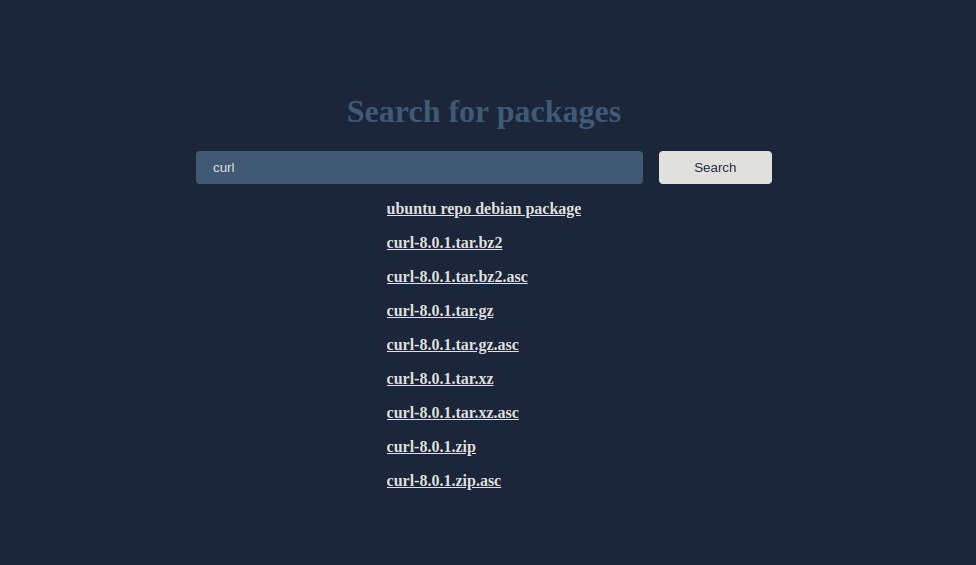

# Ubuntu Pkgs

Package Manager GUI for ubuntu. Target sources are ubuntu official website and github release's assets for a given package.

> Note: When searching for ubuntu repositories, it shows results for amd64 architecture explicitly. You need to change the puppeteer URL search params for other architectures.



## Installation

You can use `yarn` or `npm` also instead of `pnpm`

```bash
pnpm install
node index.js
```

